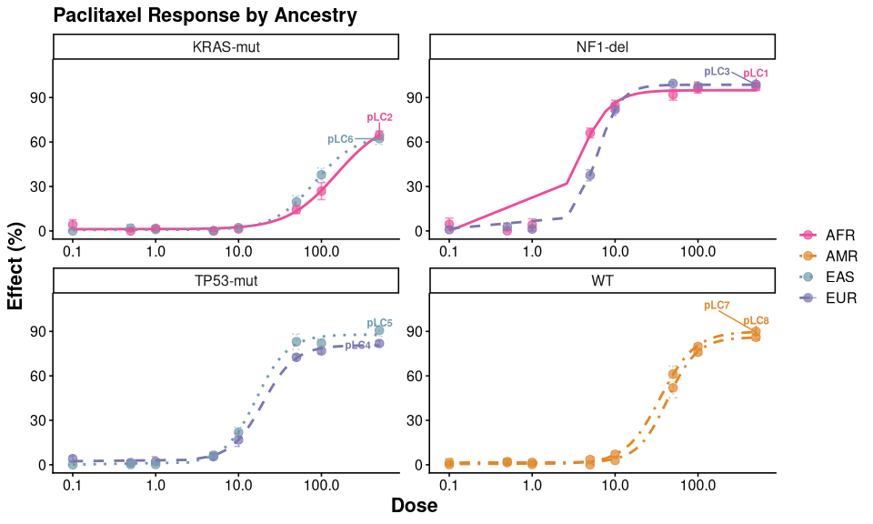
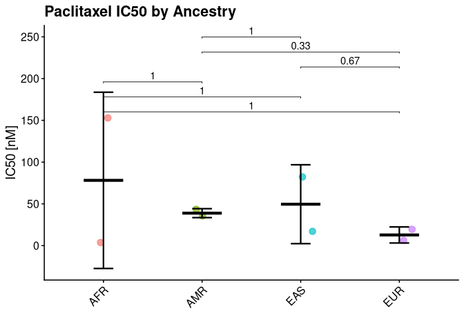

# pgxR 

<!-- badges: start -->

[](https://github.com/iLOVESenescence/pgxR/actions)
[](https://www.gnu.org/licenses/gpl-3.0)
[](https://github.com/iLOVESenescence/pgxR/actions/workflows/R-CMD-check.yaml)
<!-- badges: end -->

## Overview

**pgxR** is a pharmacogenomics toolkit for fitting, visualizing, and
comparing dose-response curves across cancer cell lines. It provides a
complete workflow from raw viability data to publication-ready figures,
with built-in support for population stratification by ancestry and
genomic feature status.

### Key features

- Fit 4-parameter log-logistic dose-response models via `drc`
- Extract IC50, AUC, and Hill slope in a single tidy table
- Visualize curves stratified by ancestry (1KGP/HGDP superpopulations)
- Facet by any genomic feature — translocation, driver mutation, CNV
  status
- Compare sensitivity across groups with built-in ANOVA and Wilcoxon
  tests
- Flexible column mapping

## Installation

``` r
# install.packages("devtools")
devtools::install_github("iLOVESenescence/pgxR")
```

## Quick start

``` r
library(pgxR)

# load built-in paclitaxel example data
data(pgxr_example)

# aggregate replicates
agg <- combine_reps(pgxr_example)

# fit dose-response models
fits <- fit_all(agg, unique(agg$cell_line))

# generate smooth predictions
preds <- predict_drc(fits, agg)

# extract all metrics in one table
metrics <- summarize_drc(fits, agg, preds)
#> 
#> Estimated effective doses
#> 
#>        Estimate Std. Error  Lower  Upper
#> e:1:50   3.5364     0.3410 2.5897 4.4832
#> 
#> Estimated effective doses
#> 
#>        Estimate Std. Error   Lower   Upper
#> e:1:50  152.766     40.390  40.626 264.906
#> 
#> Estimated effective doses
#> 
#>        Estimate Std. Error    Lower    Upper
#> e:1:50 5.958059   0.095215 5.693701 6.222418
#> 
#> Estimated effective doses
#> 
#>        Estimate Std. Error   Lower   Upper
#> e:1:50  19.5810     1.3001 15.9713 23.1907
#> 
#> Estimated effective doses
#> 
#>        Estimate Std. Error   Lower   Upper
#> e:1:50  16.1960     1.7452 11.3506 21.0414
#> 
#> Estimated effective doses
#> 
#>        Estimate Std. Error   Lower   Upper
#> e:1:50  82.9934     3.1928 74.1289 91.8579
#> 
#> Estimated effective doses
#> 
#>        Estimate Std. Error   Lower   Upper
#> e:1:50  35.0818     1.5379 30.8120 39.3516
#> 
#> Estimated effective doses
#> 
#>        Estimate Std. Error   Lower   Upper
#> e:1:50  42.6814     1.3537 38.9228 46.4399
metrics
#>   cell_line ancestry  feature       IC50 IC50_lower IC50_upper       AUC
#> 1      pLC1      AFR  NF1-del   3.536447   2.589674   4.483219 0.5920703
#> 2      pLC2      AFR KRAS-mut 152.766177  40.625935 264.906418 0.1257630
#> 3      pLC3      EUR  NF1-del   5.958059   5.693701   6.222418 0.5333453
#> 4      pLC4      EUR TP53-mut  19.580997  15.971253  23.190741 0.3234936
#> 5      pLC5      EAS TP53-mut  16.196019  11.350597  21.041442 0.3574289
#> 6      pLC6      EAS KRAS-mut  82.993387  74.128870  91.857905 0.1443219
#> 7      pLC7      AMR       WT  35.081798  30.812033  39.351564 0.2848864
#> 8      pLC8      AMR       WT  42.681382  38.922816  46.439947 0.2593990
#>   hill_slope
#> 1  -2.238351
#> 2  -1.453203
#> 3  -3.041203
#> 4  -2.224502
#> 5  -2.247405
#> 6  -1.738232
#> 7  -2.061085
#> 8  -2.401667
```

## Visualization

``` r
# dose-response curves by ancestry, faceted by genomic feature
plot_drc_anc(agg, preds, title = "Paclitaxel Response by Ancestry")
```



``` r
# IC50 comparison across ancestry groups with p-values
plot_sensitivity(metrics, group_col = "ancestry", metric = "IC50",
                 title = "Paclitaxel IC50 by Ancestry")
```



## Handling your own data

pgxR expects columns `dose`, `response`, `cell_line`, `ancestry`, and
`feature`. If your CSV uses different names, use `col_map`:

``` r
raw <- load_data(
  "my_data.csv",
  col_map = list(feature = "translocation")
)

# standardize ancestry labels to 1KGP/HGDP abbreviations
raw$ancestry <- standardize_ancestry(as.character(raw$ancestry))
```

## Citation

If you use pgxR in your research please cite:

> Hooker Q (2026). pgxR: Pharmacogenomics Dose-Response Analysis with
> Population Context. R package version 0.1.0.
> <https://github.com/iLOVESenescence/pgxR>

## License

GPL (\>= 3)
